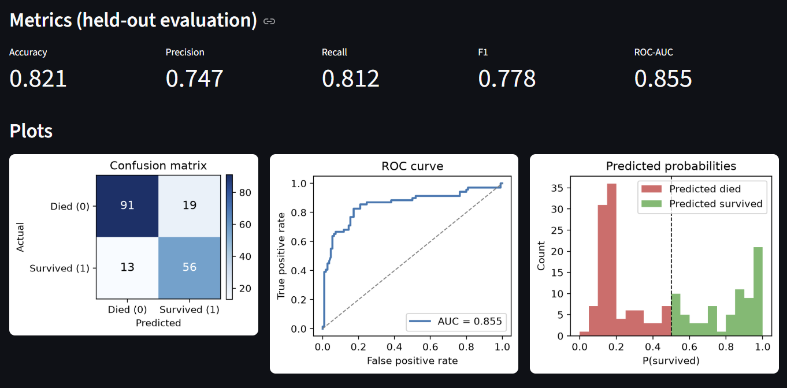
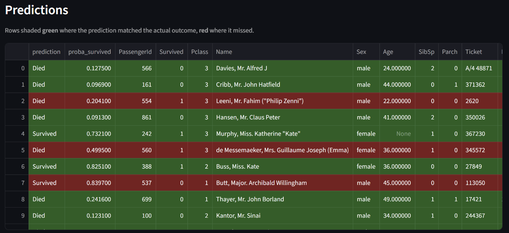
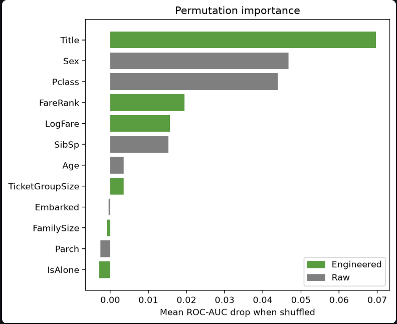
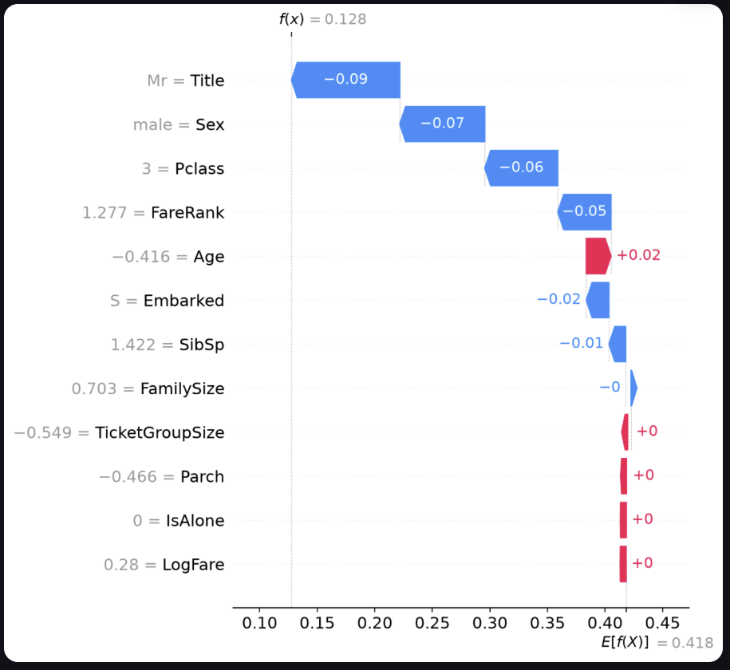

# 🚢 Titanic Survival — End-to-End Classification Pipeline

A reproducible, end-to-end machine-learning pipeline that predicts Titanic passenger
survival from the Kaggle `train.csv`. It covers data fetching, exploratory analysis,
leakage-free preprocessing, **two competing models** — a **PyTorch MLP** (deep) and an
**XGBoost** (classical) — trained by standalone scripts, and a **Streamlit**
inference app with metrics, plots, and model-explainability (permutation importance + SHAP).

> Built for the ELTA Data Scientist home assignment. Only `train.csv` is used; the
> train/validation split is created in-code and shared by both models for a fair comparison.

---

## Table of Contents

- [Features](#features)
- [Project Structure](#project-structure)
- [Setup](#setup)
  - [1. Clone & install](#1-clone--install)
  - [2. Get the data](#2-get-the-data)
  - [3. Train the models](#3-train-the-models)
  - [4. Run the Streamlit app](#4-run-the-streamlit-app)
- [Expected Outputs](#expected-outputs)
- [Screenshots](#screenshots)
- [Report](#report)
  - [Abstract](#abstract)
  - [Feature Engineering](#feature-engineering)
  - [Architectures](#architectures)
  - [Training & Evaluation](#training--evaluation)
  - [Conclusion](#conclusion)

---

## Features

- **Reproducible data fetching** — loads a local `data/train.csv`, falling back to the
  Kaggle API; deterministic stratified split (`seed=42`).
- **EDA notebook** — `notebooks/01_eda.ipynb`, 8 sections, runs clean top-to-bottom.
- **Leakage-free preprocessing** — every statistic (imputation values, scaler, fare
  reference, encoder) is fit on the **training split only**, including inside each CV fold.
- **Two models, same 23-feature matrix** — PyTorch MLP vs XGBoost, directly comparable.
- **Standalone training scripts** — hyperparameter search (`*/tune.py`) + final train
  (`*/train.py`) that save weights + the fitted preprocessor to disk.
- **Streamlit inference UI** — pick a model, point it at a CSV (path or upload), view
  metrics, plots, and per-feature / per-passenger explanations.

## Project Structure

```
src/                 shared, model-agnostic pipeline
  data.py            load_raw() — local-first, Kaggle API fallback
  split.py           stratified train/val split (shared by both models)
  features.py        stateless feature engineering (Title, FamilySize, …)
  preprocessing.py   TitanicPreprocessor — fit-on-train → 23-column matrix; save/load
mlp/                 PyTorch deep model
  model.py           MLP, train loop (early stopping, mini-batch), evaluate
  tune.py            5-fold CV grid search → models/mlp/best_config.json
  train.py           final train → models/mlp/mlp.pt + preprocessor.joblib
xgb/                 XGBoost classical model
  model.py           classifier factory, native early stopping, evaluate
  tune.py            5-fold CV grid search → models/xgb/best_config.json
  train.py           final train → models/xgb/xgb.json + preprocessor.joblib
notebooks/01_eda.ipynb   exploratory data analysis
ds_app.py            Streamlit inference + explainability app
data/                train.csv (source) + train_split.csv / val_split.csv
models/mlp/, models/xgb/   trained artifacts + best_config.json
requirements.txt
```

---

## Setup

### 1. Clone & install

```bash
git clone https://github.com/markshperkin/titanic-survival-classification.git
cd titanic-survival-classification
python -m venv .venv
# Windows:  .venv\Scripts\activate     |  macOS/Linux:  source .venv/bin/activate
pip install -r requirements.txt
```

### 2. Get the data

A copy of `data/train.csv` is included. The loader (`src/data.py`) is **local-first**: it
reads `data/train.csv` if present, otherwise downloads from Kaggle. To use the Kaggle
fallback, place your API token at `~/.kaggle/kaggle.json` (from your Kaggle account → *Create
New API Token*); the training scripts then fetch the dataset automatically.

> Only `train.csv` is used. The 80/20 train/validation split is created in code and saved to
> `data/train_split.csv` and `data/val_split.csv`.

### 3. Train the models

Each model has an optional **search** step (cross-validated hyperparameter tuning) and a
**final train** step. After search (`tune`) the best config is automatically saved in the right
location (`models/<model>/best_config.json`) for the `train` step to pick up.
Run from the project root, as modules (`-m`) so package imports resolve:

```bash
# PyTorch MLP
python -m mlp.tune       # 5-fold CV grid search → models/mlp/best_config.json   (optional)
python -m mlp.train      # final train → models/mlp/mlp.pt (+ preprocessor.joblib)

# XGBoost baseline
python -m xgb.tune       # 5-fold CV grid search → models/xgb/best_config.json    (optional)
python -m xgb.train      # final train → models/xgb/xgb.json (+ preprocessor.joblib)
```

`train.py` uses the tuned `best_config.json` if present, otherwise a sensible baked-in
default — so it always runs standalone. Pass `--force` to regenerate the train/val split.

> The assignment's `python train.py` maps to `python -m mlp.train` (the PyTorch model).

### 4. Run the Streamlit app

```bash
streamlit run ds_app.py
```

Opens at `http://localhost:8501`. In the sidebar: choose **MLP** or **XGBoost**, provide a
CSV by **path** (default `data/val_split.csv`) or **upload**, then click **Run inference**.

---

## Expected Outputs

### `python -m mlp.train`

Prints the split verification table, per-epoch train/val accuracy with early stopping, and a
final train-vs-val metrics table. Final validation metrics (this run):

```
Metrics (train vs held-out val):
              train     val
accuracy     0.8399  0.8212
precision    0.7770  0.7467
recall       0.8168  0.8116
f1           0.7964  0.7778
roc_auc      0.9033  0.8551
Baseline to beat (majority class): 0.6162
```

### `streamlit run ds_app.py`

A web app with: a metrics row, confusion matrix / ROC curve / probability histogram, a
color-coded predictions table (green = correct, red = wrong), and a **Feature influence**
section (engineered-feature view, global permutation importance, per-passenger SHAP).

---

## Screenshots

**Inference — metrics & plots**



**Predictions table (green = correct, red = wrong)**



**Feature influence — global permutation importance**



**Feature influence — per-passenger SHAP (“Why this passenger?”)**



---

## Report

### Abstract

We build and compare two survival classifiers on the Kaggle Titanic `train.csv` (891
passengers). After exploratory analysis and six engineered features, the data is encoded into
a common 23-column matrix and fed to two models sharing an identical, leakage-free pipeline and
the same stratified 80/20 split: a regularized **PyTorch MLP** and an **XGBoost** gradient-
boosted baseline. Hyperparameters are chosen by 5-fold cross-validated ROC-AUC. On the
held-out 179-passenger validation set, **XGBoost reaches 0.832 accuracy / 0.843 AUC** and the
**MLP reaches 0.821 accuracy / 0.855 AUC** — both ~20 points over the majority-class baseline
(0.615). Permutation importance and SHAP show the engineered **Title** feature is the single
strongest predictor, confirming the feature engineering — not model capacity — drives accuracy.

### Feature Engineering

The model never sees raw text columns; `Name`, `Ticket`, and `Cabin` are transformed or
dropped. Six features are engineered (`src/features.py`, `src/preprocessing.py`):

| Feature | Built from | Definition / rationale |
|---|---|---|
| **Title** | `Name` | Honorific via regex (Mr, Mrs, Miss, Master, Dr, Rev; rare → Other). A strong proxy for sex, age, and social class. |
| **FamilySize** | `SibSp` + `Parch` + 1 | Total family aboard incl. self. |
| **IsAlone** | `FamilySize` | 1 if travelling alone — captures a non-linear survival effect. |
| **TicketGroupSize** | `Ticket` | Passengers sharing a ticket (groups that boarded/travelled together). |
| **LogFare** | `Fare` | `log(1 + Fare)` — compresses heavy right-skew. |
| **FareRank** | `Fare`, `Pclass` | Fare percentile (0–1) **within the same Pclass** — relative wealth, comparable across classes and single-row inference. |

**Imputation** (fit on train only): `Age` → median **by Title** group; `Embarked` → mode (S);
`Fare` → median. **Encoding:** 7 numeric features standardized (z-score), `IsAlone` passed
through, 4 categoricals one-hot encoded with **pinned category vocabularies** so the output is
always the same **23 columns** — even when a small CV fold or a single inference row lacks a
rare class (e.g. `Title_Rev`).

**No leakage, by design.** Every learned statistic comes from the training rows only, *including
inside each cross-validation fold*. `FareRank` is computed against a stored **train** fare
reference (generalizes to one-row inference); `TicketGroupSize` is counted within the input
frame (works for inference batches). The same fitted `TitanicPreprocessor` is saved to disk and
reloaded by the Streamlit app, so training and inference share exactly one pipeline.

### Architectures

**Shared pipeline.** `src/` is model-agnostic: `data.py` (load) → `split.py` (stratified
split) → `features.py` (engineering) → `preprocessing.py` (impute, scale, encode → 23 cols).

**PyTorch MLP** (`mlp/model.py`). A small, regularized feed-forward net — with only 712 training
rows the priority is generalization, not capacity. Each hidden layer is `Linear → ReLU →
Dropout`; the head is a single logit for `BCEWithLogitsLoss`. Class imbalance (38% survive) is
handled with `pos_weight ≈ 1.6`. Optimizer Adam with weight decay. **Selected config:**
`hidden_dims=[32]`, `dropout=0.0`, `lr=0.01`, `batch_size=32`.

**XGBoost** (`xgb/model.py`). Gradient-boosted trees that add one tree at a time, each
correcting the previous trees' errors — naturally capturing the non-linear feature interactions
(class × sex × age) that make Titanic predictable. Imbalance via `scale_pos_weight`. **Selected
config:** `max_depth=4`, `learning_rate=0.1`, `subsample=0.8`, with native early stopping
selecting **26 trees**.

### Training & Evaluation

**Protocol.** Stratified 80/20 split (712 train / 179 val), `seed=42`, shared by both models.
Hyperparameters are chosen by **5-fold stratified cross-validation on the training split**,
ranked by mean **ROC-AUC** (threshold-independent and robust to the 38/62 imbalance); the
preprocessor is re-fit inside each fold. The MLP grid sweeps 150 configs (architecture, dropout,
learning rate, batch size); XGBoost sweeps 18 (depth, learning rate, subsample). The final
models retrain on the full training split with **early stopping** (MLP on validation accuracy,
patience 10; XGBoost on validation log-loss) and the 179-row validation set stays the single
honest test.

**Held-out validation results (179 passengers):**

| Model | Accuracy | Precision | Recall | F1 | ROC-AUC |
|---|---|---|---|---|---|
| Majority baseline (“all died”) | 0.6145 | – | – | – | – |
| **PyTorch MLP** | 0.8212 | 0.7467 | **0.8116** | 0.7778 | **0.8551** |
| **XGBoost** | **0.8324** | **0.7826** | 0.7826 | **0.7826** | 0.8432 |

**Explainability** (in the app). *Global* — permutation importance (shuffle a feature across the
whole validation set, measure the AUC drop) ranks **Title** first by a wide margin, then Sex and
Pclass, with engineered **FareRank** and **LogFare** in the top five. *Local* — SHAP waterfalls
decompose any single prediction from the average baseline to the final probability, attributing
each feature's push toward survived/died. Both support a one-hot grouping toggle (12 features vs
23 columns).

### Conclusion

Both models comfortably beat the baseline and land near the well-known Titanic accuracy ceiling
(~0.80–0.83). **XGBoost edges accuracy and F1**, with a tidy 26-tree model; the **MLP wins on
ROC-AUC** (better-calibrated ranking of survival probability). There is no decisive winner on a
single metric — for this small, tabular,
interaction-heavy problem the gradient-boosted trees are the more practical default, while the
MLP satisfies the deep-learning requirement and ranks survival risk slightly better.

The clearest finding is that **feature engineering, not model choice, drove performance**: the
engineered Title feature is the strongest predictor for both models, and FareRank/LogFare also
rank highly. Redundant features (IsAlone, FamilySize) contribute near zero once SibSp/Parch are
present — a candidate for pruning. Honest caveats: the 179-row validation set serves double duty
(early stopping + reporting), so reported metrics are mildly optimistic; and SHAP uses an
independent-feature masker (the standard speed/realism trade-off). Natural next steps: nested
cross-validation for an unbiased estimate, probability calibration, and threshold tuning to the
desired precision/recall trade-off.
